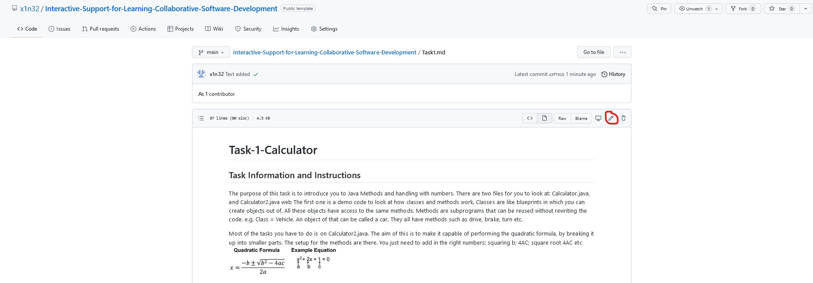
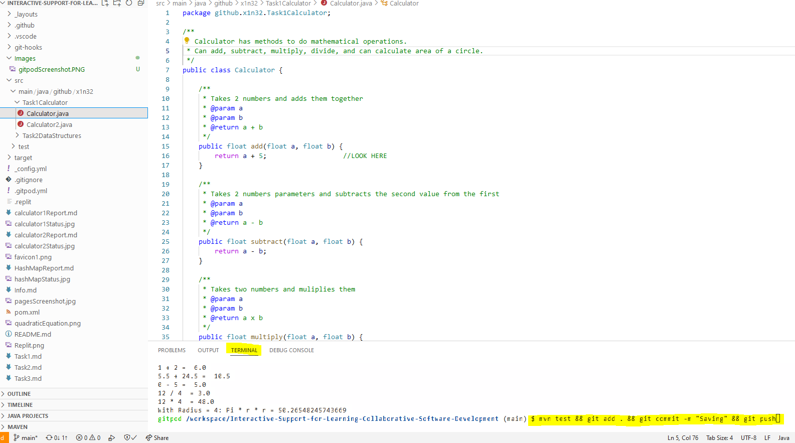
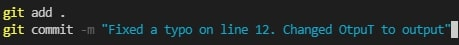
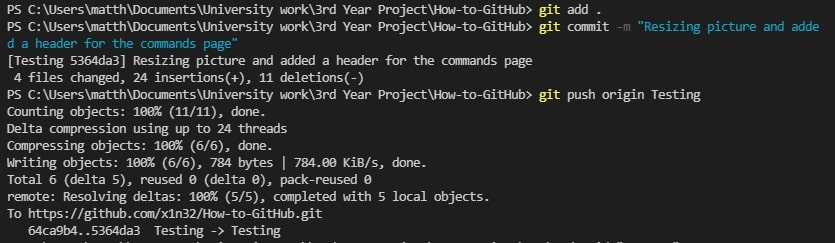
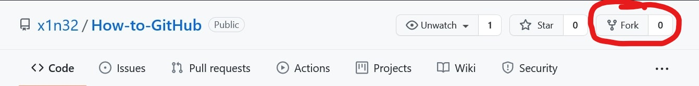
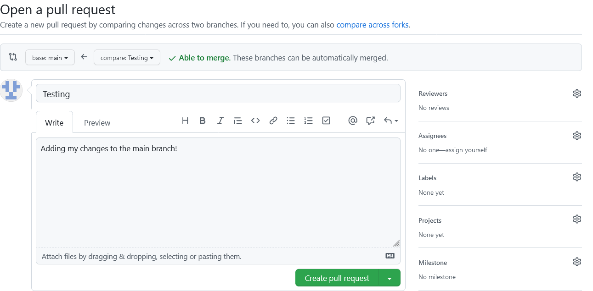

# General Information
[See Home Page](README.md) 
[See Task 1 Page](Task1.md) 
[See Task 2 Page](Task2.md) 
[See Task 3 Page](Task3.md) 

## Git
Git is a collaborative open-source version control system
This means a history of pushed changes make it easy to rollback/rollforward to easily make changes.
This also make it easy to work with others as you can share code to work on the same project
It makes use of branches, where you make 'alternate timelines' to test out code before pushing it to the main code.
Anyone can create repositories where it gets stored on GitHub to back-up code or to share!
You can use GitHub Pages to load md/html files - Go to Settings, On the left side-bar click 'pages', then on source section click the 'none' button and provide a branch. This will display that branches index.html page or ReadMe.md file as your webpage.

## Editing Files
There are two ways to edit the files here.
- Going to Gitpod and editing the file there.
- OR editing the file on GitHub by clicking on the file and then the pen icon.
  

## Using Gitpod
To load Gitpod: search gitpod.io/#  where # is your GitHub web address. 
  
- On the left are all the files. 
- The middle of the screen is where you read/write the file you opened
- On the bottom is the terminal. This is where you paste the code to save your work.

## Git commands 
These are commands you can type into the terminal.

| Command || Description |
| `git add filename` || Adds the file to the staging area. filename can be replaced with . to add all files. |
| `git commit -m meaningfullDescriptionHereInQuotes` || Used after add. This is to give it a comment on what you have changed. |
| `git add push origin main` || Pushes all your changes to the repository in the main branch |
| `git pull {repo link}/--rebase` ||  	Incorporates changes from a remote repository into the current branch. If changes are made by your teammates while you are working, you need to update your repository with the updated one to push your changes. ||
| `git branch -b newName`  || A branch is like a timeline. If you want to test ideas without affecting the main code, it is useful to make a branch and merge it later when it is ready. |
| `git checkout -b branchname` || check-out the branch you are interested in; giving you a local working copy.  |
| `git status` || List all *new or modified* files |
| `git diff` || Show file differences that **haven't been** staged |

## General Workflow
- Attempt task
- save work (git add.)
- comment save (git commit -m "meaningful message")
- push changes to repository (git push origin main)
- check answer/ read feedback
- Fix code/ attempt new task
- Optionally, create new branch to test code on, then merge with main branch.

  
  

## How to fork
Forking a repository copies the whole repository into your own account.
  

## Pull Request
When you want to edit a file on GitHub, you'll create a pull request where you suggest to the host to push your changes to add more functionality or fix bugs.
  

## Personal Access Token
I cannot push my changes as I need an access token?
To generate a personal access token to sign in instead of password: 
 - Go on GitHub
 - settings
 - developer settings
 - Personal Access Token
 - Generate. Write this code down somewhere if you need it again.

 
