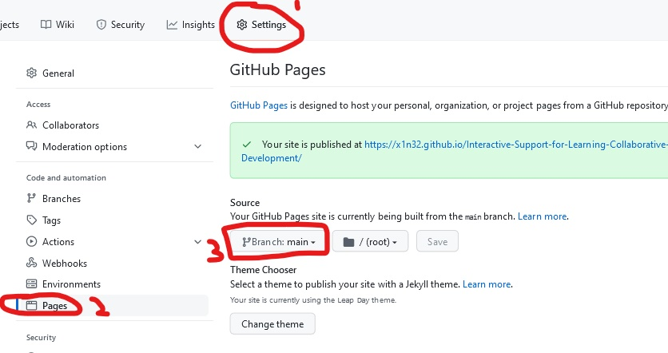

# Interactive Support for Learning Collaborative Software Development
Go to the webpage: https://x1n32.github.io/Task-1-Calculator/ <br/>
[See Task 1 Page](/Task1.md)<br/>
[See Task 2 Page](/Task2.md)<br/>
[See Task 3 Page](/Task3.md)<br/>
[See Information Page](/Info.md)<br/>

Welcome!
Here there are some coding tasks you can do. 
FIRST, make sure this repository is your own (either cloned from [Classrooms](https://classroom.github.com/a/SN5PqZFQ ) or Forking it. )

Set this repository as a webpage - go to settings, pages, on the none button click the main branch.
<br/><br/>


Open this repository on Gitpod. Also look at the Task pages to know what to do. 
It is advised to keep both tabs open, as you can see feedback on what you have done.

To save your work, paste the code below to the command line:
```shell 
mvn test && git add . && git commit -m "Saving" && git push
``` 

Below is an example of a task you can practice. 
On the IDE click on the Show Files tab and go to 
src/main/java/github/x1n32/DemoTest.jav. Click the green run button. 
When it finishes running, it will report the test results to check if what you programmed is correct! </br>
<iframe frameborder="0" width="100%" height="500px" src="https://replit.com/@MatthewChau3/DemoCode?embed=true"> Sorry your browser does not support inline frames.</iframe>

    <button onclick="updateParagraphText();">
      Click me!
    </button>

[Feel free to leave feedback here](https://forms.gle/YRE2fK2rzNPmKfcg9)<br/>
Many Thanks.

