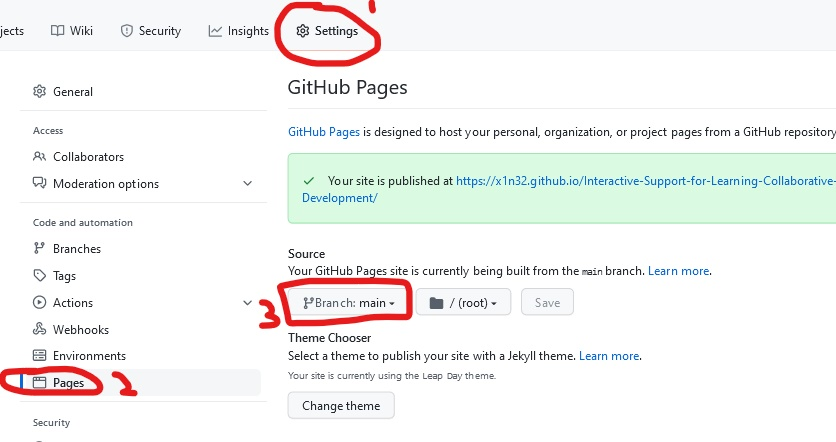

# Interactive Support for Learning Collaborative Software Development
[See Task 1 Page ](/Task1.md) 
[See Task 2 Page ](/Task2.md) 
[See Task 3 Page ](/Task3.md) 
[See Information Page ](/Info.md) 

## Welcome!
The aim of the project is to improve awareness of collaboration tools by teaching programming, showcasing unit testing and continuous integration.
- This repository has some programming tasks you can from more beginner level tasks to more harder ones in terms of concepts. 
- While attempting the tasks, you can save your work, and this can provide feedback on how you are doing. 
- You can edit these files in GitHub or in Gitpod to make notes or answer some questions. 
- There is an information page to help answer general questions as well.
- Feel free to work in pairs or in a group.

## Instructions
- FIRST, make sure this repository is your own (either cloned from [Classrooms](https://classroom.github.com/a/SN5PqZFQ ) or Forking it.

- Then set this repository as a webpage - go to settings, pages, on the none button click the main branch. The link it generates is yours.
  
Your web address would be https://x1n32-how-to-guide.github.io/coding-tasks-<team-name-here>/

- Now open your webpage, and open gitpod on another tab. 
- It is advised to keep both tabs open, as you can see feedback on what you have done.

## Save your work
To save your work, enter **submit** to the command line.
  

### Demo code 
On the IDE click on the Show Files tab and go to 
src/main/java/github/x1n32/DemoTest.jav to see what has been coded. Click the green run button. 
When it finishes running, it will report the test results to check if what you programmed is correct!  
<iframe frameborder="0" width="100%" height="500px" src="https://replit.com/@MatthewChau3/DemoCode?embed=true"> Sorry your browser does not support inline frames.</iframe>

## Feedback form
[Feel free to leave feedback here](https://forms.gle/YRE2fK2rzNPmKfcg9) 
Many Thanks.

