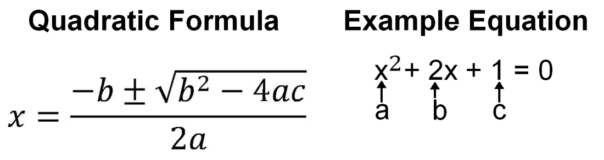

# Task-1-Calculator
[See Home Page](README.md)<br/>
[See Task 2 Page](Task2.md)<br/>
[See Task 3 Page](Task3.md)<br/>
[See Information Page](Info.md)<br/>

## Task Information and Instructions
This task has 2 files for you to look at.
Calculator.java, and Calculator2.java

The first one is a demo code to look at how classes and methods work.
It does basic mathematical functions, and can calculate the area of a circle.
Feel free to play around with it.

The main task is on Calculator2.java.
You have to make methods to do the quadratic formula (Search on the internet, like BBC Bitesize, if you are unaware of this)
The task is broken down into smaller methods. Each one is a step to do the formula such as squaring b, 4AC, square root 4AC
At the bottom there are methods for positive and a negative answer, so put + - respectively.
To help the final method is called 'quadraticFormula' - just call the positive and negative answer methods to print the results out.
<br/>


Steps:
[] Open src/main/java/github/x1n32/Task1Calculator and look at calculator.java
[] Run the code via the run button (right click -> run) or scroll to the main method at the bottom and click run
[] On the add function, change 'return a + 5' to 'return a + b'.
public float add(float a, float b) {
		return a + b;
	}
[ ] Copy the command line code below and run it in the console of your IDE.
[ ] Reload this page. Any differences?
[ ] Open calculator2.java
[ ] Fix squareOfB so that it returns the square value of input B (A number multiplied by itself e.g. num1 * num1)
[ ] Fix fourAC so that it returns the value of 4 x input a x input c (multiply in code uses the * key.)
[ ] Fix squareRootAnswer so that it returns the square root of (square of B - 4AC) (hint: Math.sqrt(X))
[ ] There are two answers to the quadratic formula. The +- on the image use either of them. 
[ ] Fix positive answer method/function by looking at the image above using +
[ ] Now do the same for the negative answer but using - instead of +
[ ] Using all the functions you have created, put it all into the final function 'quadraticFormula' so that it runs them all. This does not need to 'return' anything. Output the answers to check if you are correct. (To call a function, you type the name of the function and provide values in the brackets if required.)


 - Remember to save your work. Copy and Paste the code below. You can see your progress on the links as well.
```shell 
mvn test && git add . && git commit -m "Saving" && git push
```

## Calculator 1 status:<br/>
[See report on Calculator 1](calculator1Report.md)<br/>
<br/>
Calculator 2 status:<br/>
[See report on Calculator 2](calculator2Report.md)<br/>
<br/>

Answers are in the 'answer' branch. 


