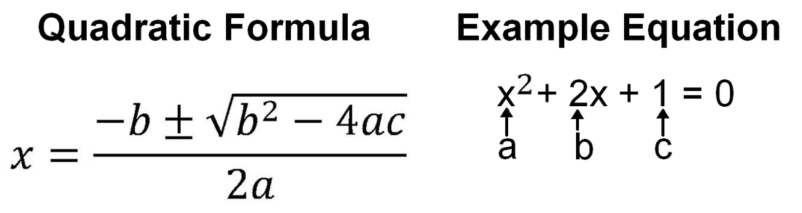
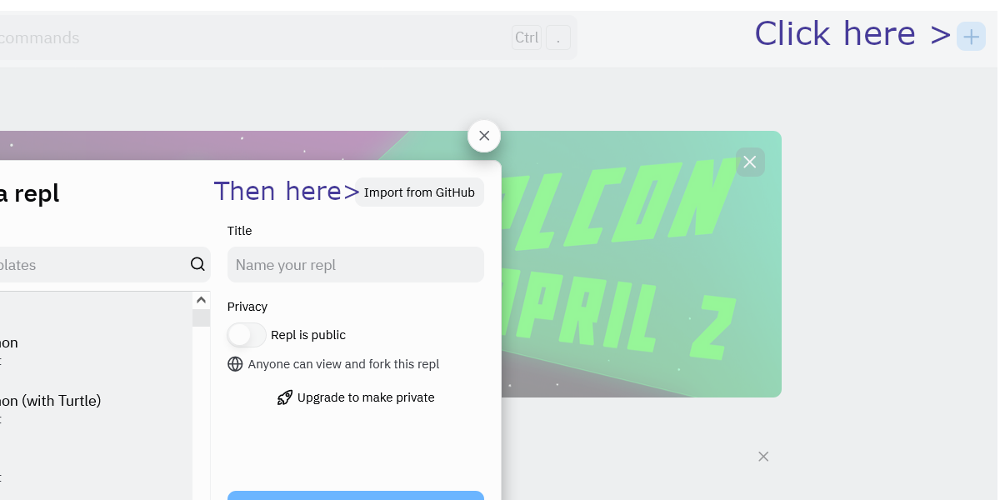

# Task-1-Calculator
[](http://gitpod.io/#https://github.com/x1n32-How-to-Guide/coding-tasks-<your-team-name-here>)<br/>
[See Home Page ](/README.md)<br/>
[See Task 2 Page ](/Task2.md) <br/>
[See Task 3 Page ](/Task3.md)<br/>
[See Information Page ](/Info.md)<br/>


## Task Information and Instructions
The purpose of this task is to introduce you to Java Methods and handling with numbers.
There are two files for you to look at: Calculator.java, and Calculator2.java
web
The first one is a demo code to look at how classes and methods work.
- Classes are like blueprints in which you can create objects out of.
- All these objects have access to the same methods.
- Methods are subprograms that can be reused without rewriting the code.
- e.g. Class = Vehicle. An object of that can be called a car. They all have methods such as drive, brake, turn etc.

Most of the tasks you have to do is on Calculator2.java.
The aim of this is to make it capable of performing the quadratic formula, by breaking it up into smaller parts.
The setup for the methods are there. You just need to add in the right numbers: squaring b; 4AC; square root 4AC etc
<br/><br/>

### Keywords:
Open this file in the GitHub editor - match keywords with definitions. Copy Paste.<br>
Keywords:
- Java
- Method
- Class
- Integer
- Float

Definitions:
- A programming language
- A subprogram which can be called many times
- A whole number
- A number that can use decimals
- A 'Cookie Cutter' which can make objects of that type

### Predict:
```java
System.out.println("Hello World");
```
- Guess what the output is from the code above:
- Actual output:  [See answer here](https://learn.onlinegdb.com/846UnWowD)<br/>

```java
System.out.println(10 + 10);
```
- Guess what the output is from the code above:
- Actual output:  [See answer here](https://learn.onlinegdb.com/1IHVeidxO)<br/>

## Introductory Tasks:
- Keep this tab open; click on the GitPod button to start programming.
- Edit <Your-team-name-here> in the link to your team name
- Click yes to anything that needs downloading.
- You should be on calculator.java (src/main/java/github/x1n32/Task1Calculator/calculator.java)
- Run the code
- On **this** page, click on the link at the calculator status link. Can you see what the error is?
-[ ] Back on GitPod, look at the add function. Change 'return a + 5' to 'return a + b'.
- Copy the 'Save your work code' and run it in the console of GitPod
- Reload this page. Any differences?

## Main Tasks: <br>
Open calculator2.java
- [ ] Fix squareOfB so that it returns the square value of input B
- [ ] Fix fourAC so that it returns the value of 4 x input a x input c
- [ ] Fix squareRootAnswer so that it returns the square root of (B squared - 4AC)
- [ ] Fix positive answer method/function
- [ ] Now do the same for the negative answer but use - instead of +
- [ ] Using all the functions you have created, put it all into the final function 'quadraticFormula' to find the answer.

### Tips/Hints
- This webpage has a link to check your progress below, and a link to GitHub.
- Going to Github can be easily accessed via the 'View on GitHub Button'.
- Gitpod can be accessed in the search bar via gitpod.io/# where # is the web address.
- Run code can be done via F5 or right-click and Run Java
- Save your work after each subtask
- Stuck on something else? Look at the information page for help
- A square of a number is a number multiplied by itself (e.g. num1 * num1)
- Multiply in java is the * key
- Square Root: Math.sqrt(X)

# Save your work
- Remember to save your work. You can see your progress on the links as well by saving.
- To save your work, enter **submit** to the command line.
<br/><br/>
<!--
```shell
mvn test && git add . && git commit -m "Saving" && git push
```
-->
# Calculator 1 status:<br/>
[See report on Calculator 1](calculator1Report.md)<br/>
<br/>

# Calculator 2 status:<br/>
[See report on Calculator 2](calculator2Report.md)<br/>
<br/>


Answers to the programming tasks are in the 'answer' branch.

Predict answers:
- Java = A programming language
- Method = A subprogram which can be called many times
- Class = A 'Cookie Cutter' which can make objects of that type
- Integer = A whole number
- Float = A number that can use decimals

### Optional. Embed an IDE to code here.
Want to code on the webpage?
Steps:
- Go to https://replit.com/ and create an account.
- Once you signed in click on the + icon on the top-right, then import from GitHub.
- Once you do that, you can work on Replit to code rather than Gitpod.
- You can also copy the web address and paste it here.
<br/><br/>

Don't be alarmed if there is a 404 error below. If you want, paste your link when you edit this file.
<iframe frameborder="0" width="100%" height="500px" src=" addYourReplitWebLinkHereButKeepThe?AndEmbedPart ?embed=true"> Sorry your browser does not support inline frames.</iframe>


