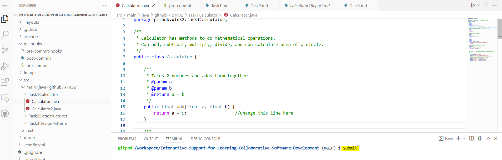

# Task-2-Data-Structures
[](http://gitpod.io/#https://github.com/x1n32-How-to-Guide/coding-tasks-<your-team-name-here>)<br/>
[See Home Page ](/README.md)<br/>
[See Task 1 Page ](/Task1.md)<br/>
[See Task 3 Page ](/Task3.md)<br/>
[See Information Page ](/Info.md)<br/>
## Task Information and Instructions
There are four files in this task: ArrayExample, ComicBooks, HashMapExercise, and ListExample.
It shows basic functions on how to add more values, and how to create them.
The purpose of this task is to show how data structures are used.
A variable is a container to hold a value that can change.
A data structure like an array can hold muliple variables.

Two coding tasks have been given: HashMapExercise, and ComicBook. Comic book uses a hash map to store 'quality' with a 'price' as key-value pairs.It also uses an enumeration which are like constants.

Remember to save your work and to check the feedback provided under this document.

### Keywords
Match the keywords with the definitions: (copy and paste)
- Data Structure
- Array
- element
- Storage
- List
- Map

- A set of data values of the same type, stored in a sequence in a computer program.
- contains values on the basis of key, i.e. key and value pair. Each key and value pair is known as an entry. Contains unique keys.
- The way that data is stored in a database or program.
- An individual component of an array.
- found in the java.util package and inherits the Collection interface.
Has the facility to maintain the ordered collection. It contains the index-based methods to insert, update, delete and search the elements.
It can have the duplicate elements also. We can also store the null elements in the list.

### Predict the output

```shell
int[] myNum = {10, 20, 30, 40};
System.out.println(myNum[1]);
```
- Guess what the output is from the code above:
- Actual output:

```shell
int[][] myNumbers = { {1, 2, 3, 4}, {5, 6, 7} }; //2D array
int x = myNumbers[1][2];
System.out.println(x);
```
- Guess what the output is from the code above:
- Actual output:

```shell
ArrayList<Integer> myNum = new ArrayList<>();
myNum.add(20);
myNum.add(10);
myNum.add(40);
myNum.add(30);
Collections.sort(myNum);
System.out.println(myNum.get(3));
```
- Guess what the output is from the code above:
- Actual output:  [See answer here](https://learn.onlinegdb.com/JU4zjIoMc)<br/>


## Introductory Steps:
- Read everything above.
- Keep this tab open, and open Gitpod
- Familiarise yourself with the arrayExample and listExample. Look at how they are created.
- Run the code. Then try to change some numbers around.
- Optional: Add some extenstions to it: Make a bubble sort, or create another array/list, Search for specific values etc


## HashMapExercise.java Steps:
- Read the code and leave a comment on what you think it does
- Check your guesses by running the code.
- [ ] Challenge 1: fix findAndReplaceEmptyValue so it loops through the hashmap and replaces empty values with the value 'Unknown Description'
- [ ] Challenge 1.2: Now make it so that it does the same for null values

- [ ] Challenge 2: Comment out the code in createNewHashMap and create a new hashmap; Make the method return "Abby".


## Optional: ComicBooks.java
**Not currently marked**
- [ ]  1: On quality.put(), change the string text (i.e. mint) to enumerated versions (Condition.MINT) instead.
- [ ]  2: add two more conditions/enumerations: PRISTINE_MINT where it sells for 5 times the price, and COVERLESS that sells for 0.1 times the price.
- [ ] 3.Then create two new comics that use those conditons.
- [ ] 4: Create an ArrayList to store comics rather than a array
- [ ] 5: Display the contents of your new Array List by using a method.
- [ ] 6: copy the for-loop in the main code below it and paste it into the method - remember to change the name comix1

### Tips/Hints
-  challenge 1 hint: if hMap.get(i) == .......
-  empty values can be "" -
-  Look at the put methods to insert data
-  use the get method to retrieve values from a hash map
-  Name the HashMap to what the rest of the code calls from.
-  Optional task 3 NOTE: Remember you have to change the size of the comix array.)


If you are ever stuck, ask a friend and look at the examples. While they may be different data structures they handle data very similarly.
Look at w3schools too.

Questions to think about:
- Which data structures are appropriate for what kinds of tasks?
- Do they have varying speeds?

# Save your work
- Remember to save your work. You can see your progress on the links as well by saving.
- To save your work, enter **submit** to the command line.
<br/><br/>

<br>
# Hash Map Task status:<br/>
[See report on Hash Map Task](HashMapReport.md)<br/>
<br/>


Answers are in the 'answer' branch.


