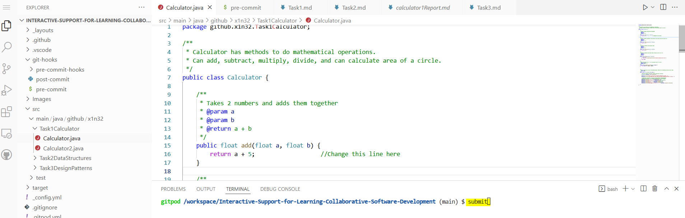

# Task-3-Design-Patterns
 
[See Home Page ](/README.md) 
[See Task 1 Page ](/Task1.md) 
[See Task 2 Page ](/Task2.md) 
[See Information Page ](/Info.md) 

## Task Information and Instructions
The foucs of this task is on Design Patterns.
In 1994 a book was created by four authors, collectively known as the Gang of Four (GoF), called:
Design Patterns - Elements of Reusable Object-Oriented Software  

Design Patterns have two main usages in software development:

1. Design patterns provide a standard terminology and are specific to particular scenario. 
2. Design patterns been tested and updated. They are the best solutions to certain problems faced during software development.
 Learning these patterns helps unexperienced developers to learn software design in an easy and faster way.

The design patterns we go through here are:
1.Observer
2.Decorator

Teamworking with another person is encouraged!

The tasks involve creating code that involves the character.java code using decorator.
- Character.java is the base. CharacterImp provides functionality to it as it now does something.
- KnightClass.java is the Decorator Class.
- Knight takes functionality from CharacterImp, and adds some of its own.
- KnightWithLightBoots and KnightWith Sword stem from the basic Knight class, by taking features of the knight class, with its own properties.

### Observer is a behaviorial design pattern. 
- Observer design pattern works with 3 classes which are Subject, Observer and Client.
- Subjects consists of list of observers and methods to attach and detach observers to a client object. 
- It also contains a method to notify all the observers of any change. 
- So: Observers watch a subject; waiting for any changes from the subject.

### Decorator is a structural design pattern.
- It provides the facility to add additional responsibilities to an existing object without altering its structure.
- It is similar to Subclassing (Parent, Child Inheritance). Except that when you have many child classes, 
- you may find you want to make another that is a mix of two+ already existing child classes.
- Rather than make another new child class, decorator is used so you avoid making any unnecesarry classes and combine the properties
 of the classes you want.
- E.g. Food. Food Decorator can have classes of 'Vegetarian', 'Indian', 'Salty', 'Chinese'.
- You don't need to make a subclass of Vegetarian Chinese food now, as you can create an object that can be decorated with vegetarian, and chinese.

## Keywords
Match Keywords with the definition. Copy and paste the definition or keywords to the other one.
ex )Object-Oriented Programming: creating objects that contain both data and methods, to have reusability for easier maintenance.

1. Design Pattern
2. Decorator Patten
3. Observer Pattern
4. Methods
5. Inheritance
6. Polymorphism

Definitions
1. A Structural design pattern. Provides the facility to add additional responsibilities to an existing object without altering its structure.
2. Using inherited methods to perform different tasks. This allows us to perform a single action in different ways.
3. A block of code which only runs when it is called. Data known as parameters can be passed. Used to perform a certain action. Also known as functions.
4. The concept of Parent and Child. Where the Child is able to do the methods the parent can, as well as inheriting it's attributes.
5. A behaviorial design pattern. A One-to-many dependency between objects so that when one object changes state, all its dependents are notified and updated automatically.
6. Represents the best practices used by experienced object-oriented software developers. They are solutions to general problems that software developers faced during software development.

## Tasks
**Not currently marked**
1. Look at the demo code provided in the Decorator and Observer folders to get familiar.
2. Create a KnightWithAShield.java class, that extends knightClass, that provides 10 extra defence, and returns " + shield " when the job function is called.
3. Let's create a new Decorator class like Knight, this time, lets have a Wizard class. Create a "WizardDecorator.java" that extends Character. Set its base magic to 20. Create a String method called magicSpell().
4. Get a friend to join your repository to create a "fireWizard.java" that extends WizardDecorator. Make magicSpell() output "Fireball!"

### EXT Tasks:
**Not currently marked**
5. Create an "apprentice.java" file. This will be your observer class.
6. Create a "Master.java" which will be another Decorator Class. This will also be our Observable class.
7. Set "Master" base stats all to 30. Create a method called "advice" similar to Channel.java's upload() method.
8. Can you notify "apprentice" when the "master" is going to call the "advice" method"

## Check Report
**TO BE ADDED**

# Save your work
- Remember to save your work. You can see your progress on the links as well by saving.
- To save your work, enter **submit** to the command line.
  
Answers are in the 'answer' branch.

Keywords answers (keyword num/ definition num):
1/6
2/1
3/5
4/3
5/4
6/2
